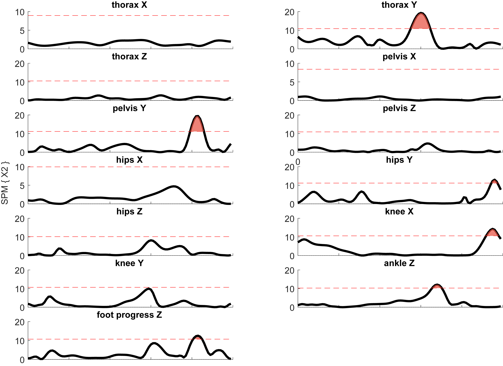

| numero | variables dépendantes        |
|--------|------------------------------|
| 1      | Thorax X (*flex/ext*)        |
| 2      | Thorax Y (*add/abd*)         |
| 3      | Thorax Z (*rot ext/rot int*) |
| 4      | Pelvis X (*flex/ext*)        |
| 5      | Pelvis Y (*add/abd*)         |
| 6      | Pelvis Z (*rot ext/rot int*) |
| 7      | Hips X (*flex/ext*)          |
| 8      | Hips Y (*add/abd*)           |
| 9      | Hips Z (*rot ext/rot int*)   |
| 10     | Knee X (*flex/ext*)          |
| 11     | Knee Y (*add/abd*)           |
| 12     | Ankle Z (*rot ext/rot int*)  |
| 13     | Foot progress Z (*rot ext/rot int*) |

## Plan statistique "idéal"

Paired Hotelling’s T^2^ test suivit de post hoc (paired t-test)
- *exemple de publication:*

[article 1](http://www.sciencedirect.com/science/article/pii/S0268003316302200)

> "[...] hotelling's T2 test (alpha = 0.05) were used to assess the three dimensional (i.e., 3-Component) time varying (1D) vectors of the hip, knee and ankle joint. By modelling the hip, knee and ankle as a 3-Component vector, the flexion/extension, ab/adduction, internal/external kinematic waveforms, as well as collinearities between them are all modelled statistically. If significant differences were observed, the three dimensional time varying (1D) vector was separated into its vector components, and analysed as time varying (1D) scalar waveforms. Conceptually, these analyses would be comparable to using a post hoc analysis when a main effect is identified with a three factor ANOVA".

[article 2](http://www.sciencedirect.com/science/article/pii/S1050641114002351)

> "Multi-muscle EMG time-series are highly correlated and time dependent yet traditional statistical analysis of scalars from an EMG time-series fails to account for such dependencies. This paper promotes the use of SPM vector-field analysis for the generalised analysis of EMG time-series.".

> "[...] we employ a SPM Hotelling’s T2 statistic to account for covariance between the EMG time-series (Fig. 1), A SPM Hotelling’s T2 test is the vector-field equivalent to the two-sample t-test (Cao and Worsley, 1999; Pataky et al., 2013)".

- Avantage: prend en compte la **co-variance** des variables dépendantes.
- Problème: nous ne pouvons pas l'utiliser car le nombre de variables choisies (13) est trop grand comparé au nombre d'observations (13 sujets moyennés).

> Warning: Results become unstable as I (number of vector components) approaches J (number of 1D responses). These techniques are suitable mainly for J much larger than I.

- Solution: éviter de moyenner tous les cycles de marches pour chaque sujets (augmente le nombre d'observations) et/ou baisser le nombre de variables choisies

## Paramétrique ou non-paramétrique ?
- Un test de normalité (*Agostino-Pearson K2 test*) indique que **6 des 13 variables ne suivent pas la loi normale**.

- De plus, considérant le faible nombre de participant ($n=13$), il conviendrait de choisir un test non-paramétrique

## Solution temporaire 1: paired t-test non paramétriques
**Attention**: avec les tests non-paramétrique, il n'est pas possible de distinguer la jambe droite et la jambe gauche pour les DoF correspondants (*hips, knee, ankle et foot progress*) car le nombre de permutations devient trop importants. Dans la figure qui suit, ce sont seulement les moyennes des deux jambes qui sont utilisées.

## Solution temporaire 2: paired t-test paramétriques